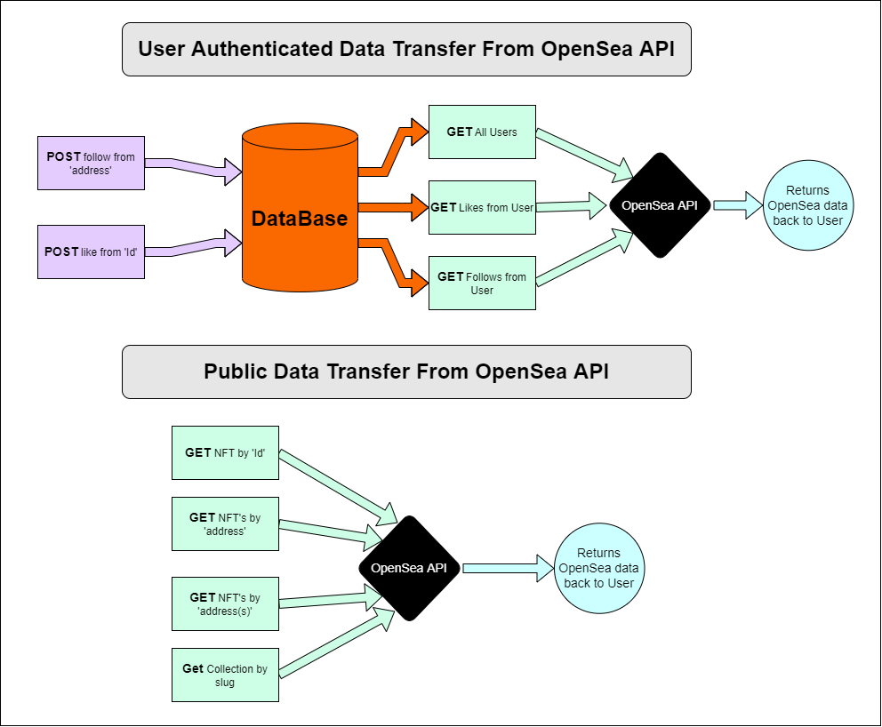

<div id="top"></div>
<!--
*** Thanks for checking out the Best-README-Template. If you have a suggestion
*** that would make this better, please fork the repo and create a pull request
*** or simply open an issue with the tag "enhancement".
*** Don't forget to give the project a star!
*** Thanks again! Now go create something AMAZING! :D
-->

<!-- PROJECT SHIELDS -->
<!--
*** I'm using markdown "reference style" links for readability.
*** Reference links are enclosed in brackets [ ] instead of parentheses ( ).
*** See the bottom of this document for the declaration of the reference variables
*** for contributors-url, forks-url, etc. This is an optional, concise syntax you may use.
*** https://www.markdownguide.org/basic-syntax/#reference-style-links
-->

[![Checks][check-sheild]][check-url]
[![codecov][codecov-sheild]][codecov-url]
[![Contributors][contributors-shield]][contributors-url]
[![Forks][forks-shield]][forks-url]
[![Stargazers][stars-shield]][stars-url]
[![Issues][issues-shield]][issues-url]
[![MIT License][license-shield]][license-url]

<!-- PROJECT LOGO -->
<br />
<!-- TODO ADD LOGO 
<div align="center">
  <a href="https://github.com/follow-the-nft/follow-the-nft-api">
    
  </a>
-->

# @Follow The NFT

<!-- TABLE OF CONTENTS -->
<div>
  <summary>Table of Contents</summary>
  <ol>
    <li><a href="#about-the-project">About The Project</a></li>
    <li><a href="#getting-started">Getting Started</a></li>
    <!-- TODO <li><a href="#usage">Usage</a></li>
    <li><a href="#roadmap">Roadmap</a></li> -->
    <li><a href="#contributing">Contributing</a></li>
    <li><a href="#license">License</a></li>
    <li><a href="#contact">Contact</a></li>
    <li><a href="#acknowledgments">Acknowledgments</a></li>
  </ol>
</div>

<!-- ABOUT THE PROJECT -->
## About The Project

>An Application secured by Auth that allows the users to search through NFT's using OpenSea API, and save their favorite NFT or artist.

<!-- TODO -->
## UML



### Built With

* [Base-64](https://www.npmjs.com/package/base-64)
* [BCrypt](https://www.npmjs.com/package/bcrypt)
* [Cors](https://www.npmjs.com/package/cors)
* [Dotenv](https://www.npmjs.com/package/dotenv)
* [ESLint](https://eslint.org/)
* [Express](https://expressjs.com/)
* [Heroku](https://heroku.com)
* [Jest](https://jestjs.io/)
* [JWT](https://jwt.io/)
* [Node Fetch](https://www.npmjs.com/package/node-fetch)
* [NodeJS](https://nodejs.org/en/)
* [OpenSea API](https://docs.opensea.io/reference/api-overview)
* [PG](https://www.npmjs.com/package/pg)
* [REST API](https://restfulapi.net/)
* [Sequelize](https://sequelize.org/)
* [SQLite3](https://www.sqlite.org/)
* [SuperTest](https://www.npmjs.com/package/supertest)
* [Nock](https://www.npmjs.com/package/nock)

## Getting Started

```sh
# Install NPM
npm install npm@latest -g

# Clone the repository
git clone git@github.com:follow-the-nft/follow-the-nft-api.git

# Dev Database setup
psql
CREATE DATABASE "follow-the-nft";
\q

# Install dependencies
npm install

# Running locally
npm run dev

# Running tests
npm run test
```

## Optional for using in Production Environment

Request API Key from [Opensea](https://docs.opensea.io/reference/request-an-api-key)

API is free to use on lmited basis. To use the API in a production environment, request key from URL above. Enter email address, project name, project description, and a link to the project website. Approval takes 1-2 days.

Use API key in the header of request.

```JavaScript
INSTALLATION
npm install axios --save

REQUEST
import axios from "axios";

const options = {
  method: 'GET',
  url: 'https://api.opensea.io/api/v1/asset/0xb47e3cd837ddf8e4c57f05d70ab865de6e193bbb/1/',
  headers: {'X-API-KEY': 'apiKeyHere'}
};

axios.request(options).then(function (response) {
  console.log(response.data);
}).catch(function (error) {
  console.error(error);
});
```

<!-- TODO USAGE EXAMPLES  -->
## Usage

Our application is a backend application. We recommend using Postman to hit our routes.

### Heroku Deployment

[Heroku Deployment](https://follow-the-nft.herokuapp.com/)

## Public Routes

### Get: NFT by Token and Address

```
http://localhost:3001/<address>/<token_id>

This will return back a NFT 
```

### Get: NFT by Address

```
http://localhost:3001/address/<address>

Will return back wallet address 

http://localhost:3001/addresses/<addresses>

Will return back wallet addresses by how many address you add
```

### Get: Collection by Slug

```
http://localhost:3001/collection/<slug>

Will return back a collection based on the slug passed in
```

## Auth Routes

### Post: Register your account

```
http://localhost:3001/register

Pass in your desired username, password

ex.

{
  "username": "testUserName",
  "password": "testPassword",
}

### Post: NFT you like

```
http://localhost:3001/likes/<address>/<token_id>

This will save your liked NFT to the database in an array format

If you post the same `address` and `token_id`, it will remove the liked NFT from the database
```

### Get: Your NFT you have liked

```
http://localhost:3001/likes

This will return back your NFT assets in an array format
```

### Post: NFT you want to follow

```
http://localhost:3001/follows/<address>

This will save the wallet of the address to the database in an array format

If you post the same `address`, it will remove the followed NFT from the database
```

### Get: Your NFT you have followed

```
http://localhost:3001/follows

This will return back your NFT wallet in an array format
```

<!-- ROADMAP 
## Roadmap

- [] Feature 1
- [] Feature 2
- [] Feature 3
    - [] Nested Feature
-->

See the [open issues](https://github.com/follow-the-nft/follow-the-nft-api/issues) for a full list of proposed features (and known issues).

## Testing

This repository is tested using [jest](https://jestjs.io/). An example test can be seen below.

```JavaScript
'use strict'

const supertest = require('supertest')
const server = require('./server')
const request = supertest(server.server)

describe('Given /', () => {
  describe('When GET', () => {
    it('Then returns 200 status', async () => {
      const response = await request.get('/')
      expect(response.status).toEqual(200)
    })

    it('Then returns correct response body', async () => {
      const response = await request.get('/')
      expect(response.text).toEqual('@FollowTheNFT')
    })
  })
})

```

<!-- CONTRIBUTING -->
## Contributing

Contributions are what make the open source community such an amazing place to learn, inspire, and create. Any contributions you make are **greatly appreciated**.

If you have a suggestion that would make this better, please fork the repo and create a pull request. You can also simply open an issue with the tag "enhancement".
Don't forget to give the project a star! Thanks again!

1. Fork the Project
2. Create your Feature Branch (`git checkout -b feature/AmazingFeature`)
3. Commit your Changes (`git commit -m 'Add some AmazingFeature'`)
4. Push to the Branch (`git push origin feature/AmazingFeature`)
5. Open a Pull Request

<!-- LICENSE -->
## License

Distributed under the MIT License. See `LICENSE.txt` for more information.

<!-- CONTACT -->
## Contact

Heather Bisgaard - [@GitHub_handle](https://github.com/vbchomp) - vbchomp@gmail.com  
Charlie Fadness - [@GitHub_handle](https://github.com/fadnesscharlie) - fadness.charlie@hotmail.com  
Tom McGuire - [@GitHub_handle](https://github.com/MuckT) - mcgtom10@gmail.com  
Jeremy Brazell - [@GitHub_handle](https://github.com/jeremywbrazell) - jwbrazell@gmail.com  

Project Link: [https://github.com/follow-the-nft/follow-the-nft-api](https://github.com/follow-the-nft/follow-the-nft-api)

<!-- ACKNOWLEDGMENTS -->
## Acknowledgments

* [OpenSea API](https://docs.opensea.io/reference/api-overview)
* [MetaMask](https://chrome.google.com/webstore/detail/metamask/nkbihfbeogaeaoehlefnkodbefgpgknn)
* [Crypto Art Evolution](https://youtu.be/2D6iqZLKhLY)
* [How to create a peer to peer NFT marketplace](https://docs.tatum.io/tutorials/how-to-create-a-peer-to-peer-nft-marketplace)
* [Array Values in Sequelize](https://stackoverflow.com/a/44365347)

<p align="right">(<a href="#top">back to top</a>)</p>

<!-- MARKDOWN LINKS & IMAGES -->
<!-- https://www.markdownguide.org/basic-syntax/#reference-style-links -->
[contributors-shield]: https://img.shields.io/github/contributors/follow-the-nft/follow-the-nft-api.svg
[contributors-url]: https://github.com/follow-the-nft/follow-the-nft-api/graphs/contributors
[forks-shield]: https://img.shields.io/github/forks/follow-the-nft/follow-the-nft-api.svg
[forks-url]: https://github.com/follow-the-nft/follow-the-nft-api/network/members
[stars-shield]: https://img.shields.io/github/stars/follow-the-nft/follow-the-nft-api.svg
[stars-url]: https://github.com/follow-the-nft/follow-the-nft-api/stargazers
[issues-shield]: https://img.shields.io/github/issues/follow-the-nft/follow-the-nft-api
[issues-url]: https://github.com/follow-the-nft/follow-the-nft-api/issues
[license-shield]: https://img.shields.io/github/license/follow-the-nft/follow-the-nft-api.svg
[license-url]: https://github.com/follow-the-nft/follow-the-nft-api/blob/master/LICENSE.txt
[check-sheild]: https://github.com/follow-the-nft/follow-the-nft-api/actions/workflows/checks.yaml/badge.svg
[check-url]: https://github.com/follow-the-nft/follow-the-nft-api/actions/workflows/checks.yaml
[codecov-sheild]: https://codecov.io/gh/follow-the-nft/follow-the-nft-api/branch/main/graph/badge.svg?token=7SL7D08EZB
[codecov-url]: https://codecov.io/gh/follow-the-nft/follow-the-nft-api
