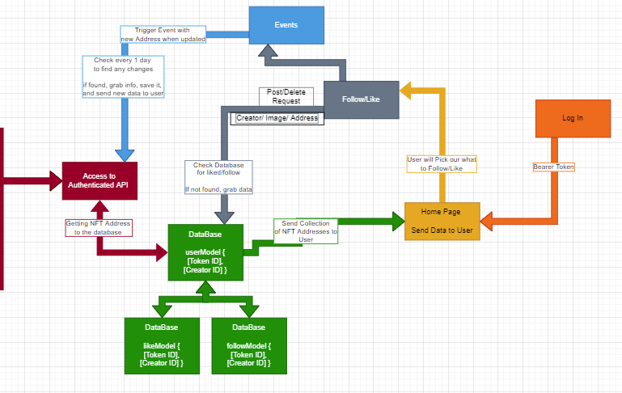

<div id="top"></div>
<!--
*** Thanks for checking out the Best-README-Template. If you have a suggestion
*** that would make this better, please fork the repo and create a pull request
*** or simply open an issue with the tag "enhancement".
*** Don't forget to give the project a star!
*** Thanks again! Now go create something AMAZING! :D
-->


<!-- PROJECT SHIELDS -->
<!--
*** I'm using markdown "reference style" links for readability.
*** Reference links are enclosed in brackets [ ] instead of parentheses ( ).
*** See the bottom of this document for the declaration of the reference variables
*** for contributors-url, forks-url, etc. This is an optional, concise syntax you may use.
*** https://www.markdownguide.org/basic-syntax/#reference-style-links
-->
[![Contributors][contributors-shield]][contributors-url]
[![Forks][forks-shield]][forks-url]
[![Stargazers][stars-shield]][stars-url]
[![Issues][issues-shield]][issues-url]
[![MIT License][license-shield]][license-url]
[![LinkedIn][linkedin-shield]][linkedin-url]


<!-- PROJECT LOGO -->
<br />
<div align="center">
  <a href="https://github.com/follow-the-nft/follow-the-nft-api">
    
  </a>

<h3 align="center">Follow The NFT</h3>

  <p align="center">
    An Application secured by Auth that allows the users to follow and/or like their favorite NFT's
    <br />
    <a href="https://github.com/follow-the-nft/follow-the-nft-api"><strong>Explore the docs »</strong></a>
    <br />
    <br />
    <a href="https://github.com/follow-the-nft/follow-the-nft-api">View Demo</a>
    ·
    <a href="https://github.com/follow-the-nft/follow-the-nft-api/issues">Report Bug</a>
    ·
    <a href="https://github.com/follow-the-nft/follow-the-nft-api/issues">Request Feature</a>
  </p>
</div>


<!-- TABLE OF CONTENTS -->
<details>
  <summary>Table of Contents</summary>
  <ol>
    <li>
      <a href="#about-the-project">About The Project</a>
      <ul>
        <li><a href="#built-with">Built With</a></li>
      </ul>
    </li>
    <li>
      <a href="#getting-started">Getting Started</a>
      <ul>
        <li><a href="#prerequisites">Prerequisites</a></li>
        <li><a href="#installation">Installation</a></li>
      </ul>
    </li>
    <li><a href="#usage">Usage</a></li>
    <li><a href="#roadmap">Roadmap</a></li>
    <li><a href="#contributing">Contributing</a></li>
    <li><a href="#license">License</a></li>
    <li><a href="#contact">Contact</a></li>
    <li><a href="#acknowledgments">Acknowledgments</a></li>
  </ol>
</details>


<!-- ABOUT THE PROJECT -->
## About The Project

[![Product Name Screen Shot][product-screenshot]](https://example.com)

<p align="right">(<a href="#top">back to top</a>)</p>

## UML




<!-- Here's a blank template to get started: To avoid retyping too much info. Do a search and replace with your text editor for the following: `follow-the-nft`, `follow-the-nft-api`, `twitter_handle`, `linkedin_username`, `email`, `email_client`, `Follow The NFT`, `An Application secured by Auth that allows the users to follow and/or like their favorite NFT's` -->

<p align="right">(<a href="#top">back to top</a>)</p>


### Built With

* [NodeJS](https://nodejs.org/en/)
* [Express](https://expressjs.com/)
* [Opensea API](https://docs.opensea.io/reference/api-overview)
* [REST API](https://restfulapi.net/)
<!-- * [NodeJS Events](https://reactjs.org/) -->

<p align="right">(<a href="#top">back to top</a>)</p>


<!-- GETTING STARTED -->
## Getting Started

This is an example of how you may give instructions on setting up your project locally.
To get a local copy up and running follow these simple example steps.

### Prerequisites

This is an example of how to list things you need to use the software and how to install them.
* npm
  ```sh
  npm install npm@latest -g
  ```

### Installation

1. Get a free API Key at [https://example.com](https://example.com)
2. Clone the repo
   ```sh
   git clone git@github.com:follow-the-nft/follow-the-nft-api.git
   ```
3. Install NPM packages
   ```sh
   npm install
   ```
4. Enter your API in `config.js`
   ```js
   const API_KEY = 'ENTER YOUR API';
   ```

<p align="right">(<a href="#top">back to top</a>)</p>


<!-- USAGE EXAMPLES -->
## Usage

Use this space to show useful examples of how a project can be used. Additional screenshots, code examples and demos work well in this space. You may also link to more resources.

_For more examples, please refer to the [Documentation](https://example.com)_

<p align="right">(<a href="#top">back to top</a>)</p>


<!-- ROADMAP -->
## Roadmap

- [] Feature 1
- [] Feature 2
- [] Feature 3
    - [] Nested Feature

See the [open issues](https://github.com/follow-the-nft/follow-the-nft-api/issues) for a full list of proposed features (and known issues).

<p align="right">(<a href="#top">back to top</a>)</p>

## Testing
```
How to Implement Testing
```

<p align="right">(<a href="#top">back to top</a>)</p>


<!-- CONTRIBUTING -->
## Contributing

Contributions are what make the open source community such an amazing place to learn, inspire, and create. Any contributions you make are **greatly appreciated**.

If you have a suggestion that would make this better, please fork the repo and create a pull request. You can also simply open an issue with the tag "enhancement".
Don't forget to give the project a star! Thanks again!

1. Fork the Project
2. Create your Feature Branch (`git checkout -b feature/AmazingFeature`)
3. Commit your Changes (`git commit -m 'Add some AmazingFeature'`)
4. Push to the Branch (`git push origin feature/AmazingFeature`)
5. Open a Pull Request

<p align="right">(<a href="#top">back to top</a>)</p>


<!-- LICENSE -->
## License

Distributed under the MIT License. See `LICENSE.txt` for more information.

<p align="right">(<a href="#top">back to top</a>)</p>


<!-- CONTACT -->
## Contact

Heather Bisgaard - [@GitHub_handle](https://github.com/vbchomp) - vbchomp@gmail.com  
Charlie Fadness - [@GitHub_handle](https://github.com/fadnesscharlie) - fadness.charlie@hotmail.com  
Tom McGuire - [@GitHub_handle](https://github.com/MuckT) - mcgtom10@gmail.com  
Jeremy Brazell - [@GitHub_handle](https://github.com/jeremywbrazell) - jwbrazell@gmail.com  

Project Link: [https://github.com/follow-the-nft/follow-the-nft-api](https://github.com/follow-the-nft/follow-the-nft-api)

<p align="right">(<a href="#top">back to top</a>)</p>


<!-- ACKNOWLEDGMENTS -->
## Acknowledgments

* [OpenSea API](https://docs.opensea.io/reference/api*overview)
* [MetaMask](https://chrome.google.com/webstore/detail/metamask/nkbihfbeogaeaoehlefnkodbefgpgknn)
* [Crypto Art Evolution](https://youtu.be/2D6iqZLKhLY)
* [How to create a peer to peer NFT marketplace](https://docs.tatum.io/tutorials/how-to-create-a-peer-to-peer-nft-marketplace)

<p align="right">(<a href="#top">back to top</a>)</p>


<!-- MARKDOWN LINKS & IMAGES -->
<!-- https://www.markdownguide.org/basic-syntax/#reference-style-links -->
[contributors-shield]: https://img.shields.io/github/contributors/follow-the-nft/follow-the-nft-api.svg?style=for-the-badge
[contributors-url]: https://github.com/follow-the-nft/follow-the-nft-api/graphs/contributors
[forks-shield]: https://img.shields.io/github/forks/follow-the-nft/follow-the-nft-api.svg?style=for-the-badge
[forks-url]: https://github.com/follow-the-nft/follow-the-nft-api/network/members
[stars-shield]: https://img.shields.io/github/stars/follow-the-nft/follow-the-nft-api.svg?style=for-the-badge
[stars-url]: https://github.com/follow-the-nft/follow-the-nft-api/stargazers
[issues-shield]: https://img.shields.io/github/issues/follow-the-nft/follow-the-nft-api.svg?style=for-the-badge
[issues-url]: https://github.com/follow-the-nft/follow-the-nft-api/issues
[license-shield]: https://img.shields.io/github/license/follow-the-nft/follow-the-nft-api.svg?style=for-the-badge
[license-url]: https://github.com/follow-the-nft/follow-the-nft-api/blob/master/LICENSE.txt
[linkedin-shield]: https://img.shields.io/badge/-LinkedIn-black.svg?style=for-the-badge&logo=linkedin&colorB=555
[linkedin-url]: https://linkedin.com/in/linkedin_username
[product-screenshot]: images/screenshot.png
